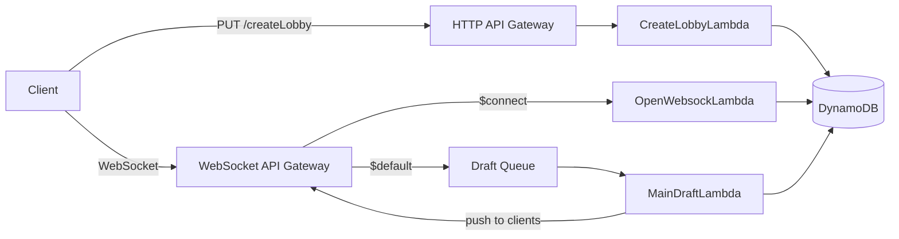

# Monster Draft (Public App)

## Overview

Monster Draft is a real-time multiplayer card-drafting game built on a fully serverless AWS stack. Players create lobbies via HTTP, then connect over WebSocket to draft cards in real time. The backend is Java 25 Lambda handlers (with SnapStart for fast cold starts) orchestrated by CDK-managed infrastructure in TypeScript.

## Architecture



- **HTTP API** handles lobby creation (`PUT /createLobby`).
- **WebSocket API** manages real-time draft sessions. The `$connect` route validates and registers sessions; all other client messages route through `$default` into an SQS queue.
- **SQS** decouples client actions from processing, giving the draft handler a consistent invocation model and built-in retry/DLQ support.
- **MainDraftLambda** consumes batches from the queue, processes game logic, and pushes state updates back to connected clients via the WebSocket management API.
- **DynamoDB** stores session state (SessionsTable) and all game/draft state (DraftTable). Stale sessions are cleaned up via TTL.
- **SnapStart** is enabled on all handlers to minimize Java cold-start latency.

## Project Layout

```
.
├── src/                          # CDK app entry point
├── lib/                          # CDK stack definitions
│   ├── ..._data-stack.ts         #   DynamoDB tables + SQS queues
│   ├── ..._lambda-stack.ts       #   Lambda functions (Java 25, SnapStart)
│   └── ..._api-stack.ts          #   HTTP API + WebSocket API
├── resources/
│   └── monster-draft-handlers/   # Java Lambda source (Maven multi-module)
│       ├── common/               #   Shared utilities and models
│       ├── create-lobby-handler/ #   PUT /createLobby handler
│       ├── open-websock-handler/ #   WebSocket $connect handler
│       └── main-draft-handler/   #   SQS-triggered draft logic handler
├── docs/
│   ├── accesspatterns.yml        # API access pattern reference
│   └── schema.yaml               # DynamoDB schema design
├── test/                         # CDK infrastructure tests (Jest)
└── cdk.json                      # CDK toolkit configuration
```

## Prerequisites

- **JDK 25** (for compiling the Lambda handlers)
- **Maven 3.9+**
- **Node.js 20+** and **npm**
- **AWS CDK CLI** (globally installed: `npm install -g aws-cdk`)
- **AWS credentials** configured (`aws configure` or environment variables)

## Build & Deploy

1. **Package the Java handlers:**

   ```sh
   ./mvn-pkg-all.sh
   ```

   This runs `mvn -f ./resources/monster-draft-handlers/pom.xml clean package` and produces shaded JARs under each handler's `target/` directory.

2. **Deploy infrastructure:**

   ```sh
   cdk deploy --all
   ```

Before deploying, you can validate your changes:

```sh
cdk synth   # Emit CloudFormation templates
cdk diff    # Compare deployed stack with local state
```

## Testing

**CDK infrastructure tests** (TypeScript, Jest):

```sh
npm test
```

**Java unit tests** (JUnit Jupiter):

```sh
mvn -f ./resources/monster-draft-handlers/pom.xml test
```

### Integration tests

The `common` module includes integration tests that run DynamoDB operations against sandbox tables (`TestGames`, `TestSessions`) in a real AWS account. To run them:

1. Ensure the sandbox tables exist in the target account/region.
2. Set the required environment variables:

   ```sh
   export MONSTERCUBEDRAFT_TEST_AWS_PROFILE=<your-sso-profile>
   export MONSTERCUBEDRAFT_TEST_AWS_REGION=us-east-1
   ```

3. Log in via SSO before running:

   ```sh
   aws sso login --profile <your-sso-profile>
   ```

4. Run tests as usual with `mvn test`. The integration tests use the profile credentials to authenticate against DynamoDB directly.

## Project Status

Early development. Infrastructure stacks are defined and deployable. Lambda handlers are being actively built out. Core game logic (lobby creation, WebSocket session management, draft processing) is in progress.
